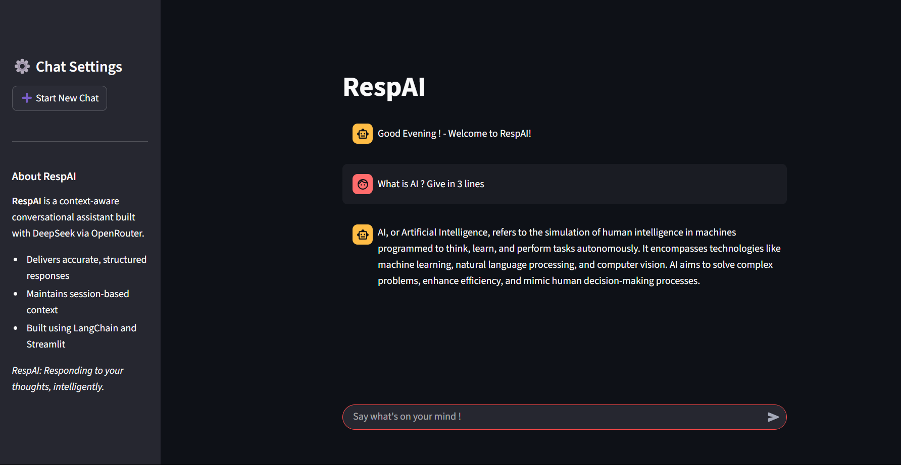

  
  RespAI

**RespAI** is a context-aware conversational chatbot built using Streamlit, LangChain, and the DeepSeek language model via OpenRouter.

## ✨ Features

- Conversational memory with contextual understanding
- Powered by DeepSeek through OpenRouter (free and accessible)
- Clean, responsive UI built with Streamlit
- Session-based chat with new chat reset option
- Sidebar with assistant info

## 🧠 Tech Stack

- [Streamlit](https://streamlit.io/) — frontend UI
- [LangChain](https://www.langchain.com/) — chaining and prompt management
- [OpenRouter](https://openrouter.ai/) — API gateway for LLMs
- [DeepSeek](https://www.deepseek.com/) — LLM (free-tier)

---

## 📸 Screenshots
|  |  |
|------------|-------------|
|  |  |

---

## 👤 Author
**Praveen Kumar V**  
*B.E. Artificial Intelligence and Machine Learning*  
[Mail ID](mailto:praveenkumarv0811@gmail.com)  
[Portfolio](https://buildwithpraveen.vercel.app) | [LinkedIn](https://www.linkedin.com/in/praveenkumar-v08/)
